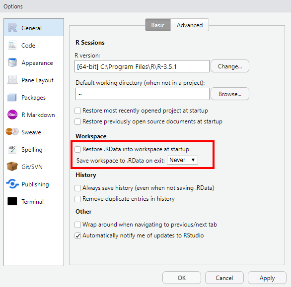
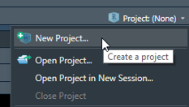
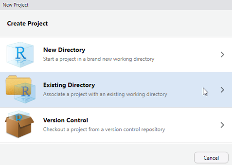
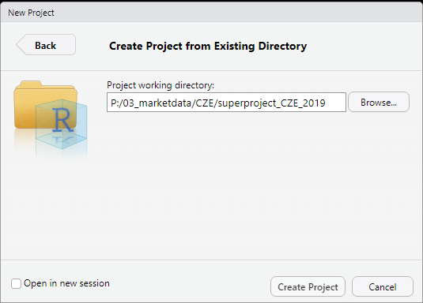
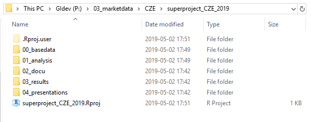
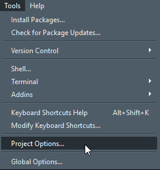
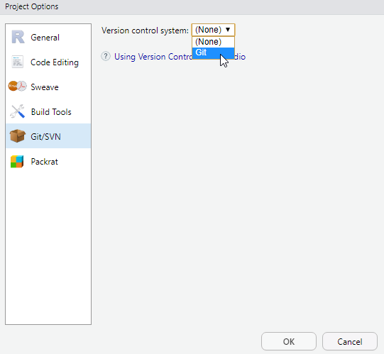
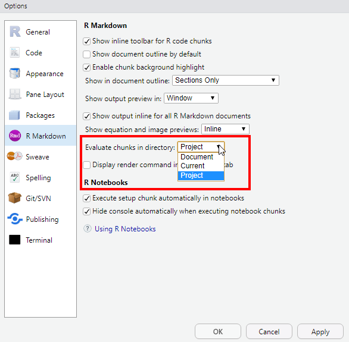

# projmaker																	
---

## Overview

The _projmaker_ should help to setup a project at GeoInsights.
In future projects, a common structure for folders and a common guideline for file naming should be applied.

In general, this is a corpus (minimal set) of folders structured according to a general workflow typical at GeoInsights.
Feel free to add or delete folders (e.g. *0111_regiograph_files*).  
There should be ample room for individual modifications to create a best structure for any given project.
Especially the top level folder structure should remain as proposed here.

If you have suggestions please contact [Christoph Stepper](mailto:christoph.stepper@gfk.com) or [Anja Waldmann](mailto:anja.waldmann@gfk.com).

## Current structure

[//]: # (run in cmd: tree /f and copy output from cmd)


```bash
├───00_basedata						# raw (delivered) data sets and data documentation; input only - i.e. never to be overwridden!
│   ├───001_data						# the data itself
│   └───002_metadata					# documentation for the data
├───01_analysis						# anything to do with analysis/work-in-progress
│   ├───0101_data						# intermediate data sets, e.g. results from individual analysis modules (tip: name subfolders corresponding to your R-scripts and save your data)
│   ├───0110_code						# all code files, i.e. R code, py code, SAS code, etc.
│   │   ├───01100_r_functions				# R functions necessary for projects (longer than a 3-liner), but not worth to be put into a GIpackage; sourced within scripts to avoid code repetition	
│   │   ├───01101_r_scripts					# R scripts for all analysis steps/modules, named in a comprehensible way (tip: number scrips in the order they need to be executed)	
│   │   └───01102_r_markdowns				#  if applicable, R markdown files (eg. for documentations etc.)
│   ├───0120_figures					# any static or interactive visualisations generated during the analysis
│   ├───0121_leaflets					# any map visualisation generated during the analysis
│   ├───0130_checks						# anything that is to be checked by people other than the analysis author, e.g. excel comparison files in purchasing power
│   └───0140_misc						# place for things that somehow do not fit into any of the above, e.g. colour definitions for logos
├───02_docu							# project documentation and final checks (Checkliste)
├───03_results						# final results that are to be delivered to the client or that are to be pushed to our official products
└───04_presentations				# things for kick-of/intermediate/final presentations
```


## General Remarks

If you work with R, it is generally a good idea to set the __Workspace Options__ as follows:

1. Uncheck _Restore .RData into workspace at startup_
2. Set _Save workspace to .RData on exit:_ to __Never__

	

It is advisable to use _RStudio Projects_ when working in a project mostly done in R.  
Doing so, you can use relative paths to navigate to files within the project and the project keeps working when moved to another location (e.g. another drive).

## Workflow

### Generate folder structure

To generate a valid folder structure, just follow these steps:

1. Copy the *makeproj.cmd* into the root directory where the new project should be locatad in
2. Execute the file by left double-click
3. Follow the user prompts to setup the folder structure
	+ Enter a valid name for the study, etc.
	+ Delete *cmd* from the root directory (either automatically or manually)


	
### Setup RStudio Project

To setup the project, open RStudio and execute:

1. Navigate to _Project: (None)_ (topright in RStudio GUI) and click on _New Project_

	
	
2. Select: Create Project in _Existing Directory_

	

3. Navigate to your project directory to set this as project working directory

	
	
When a new RStudio project is created,
* a project file (_*.proj_) is created within the project directory, containing various project settings,
* a hidden directory (named _.Rproj.user_) is created, where project specific temporary files are stored .



If you want to version control your project with _Git_, navigate to the Project Options and select _Git_ as Version control system. 
Then a new git repository gets initialized (hidden _.git_ folder and _.gitignore_ file in project working directory).





More info on working with RStudio projects can be found here:  
[Using Projects](https://support.rstudio.com/hc/en-us/articles/200526207-Using-Projects)

## Remarks

If you want to spin R files (-> Markdown -> html) within a project, you should set the _R Markdown Option_ as follows:
* Evaluate chunks in directory: _Project_
 



